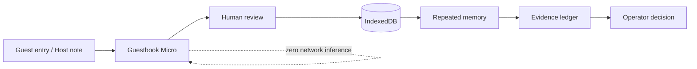

<p align="center">
  
</p>

<h1 align="center">Guestbook</h1>

<p align="center">
  <strong>Every visit teaches the business.</strong><br />
  Offline-first Small AI that turns messy visitor conversations into inspectable business memory.
</p>

<p align="center">
  <a href="https://guestbook-small-ai.vercel.app/">Live demo</a> ·
  <a href="docs/model-card.md">Model card</a> ·
  <a href="docs/system-design.md">System design</a> ·
  <a href="docs/external-evidence.md">External evidence</a>
</p>

> Built for the **7th Hack-Nation Global AI Hackathon** — **World Bank: Small AI for Development, Track C (Tourism)**.

## The problem

Small tourism operators learn valuable things in ordinary conversations: what visitors loved, what was difficult, what they wanted to buy, and what would make them return. Most of that information disappears when the conversation ends.

Guestbook turns those comments into a local, reviewable evidence trail without putting a general-purpose LLM, cloud inference, or autonomous business decisions in the critical path.

## What the product does

**Capture → Interpret → Review → Remember → Verify → Decide**

1. A visitor submits feedback, or the host records a **Host note** after a conversation.
2. **Guestbook Micro** performs local multilabel language interpretation.
3. A human reviews the proposed signals before they become memory.
4. Confirmed signals accumulate across distinct visits.
5. Every pattern stays linked to its original source text and provenance.
6. The operator decides what to do. Guestbook never acts automatically.

The visible product is intentionally small: **Guest, Review, Memory, Evidence, Decide, System**.

## Small AI, bounded on purpose

| Property | Guestbook Micro v1 |
| --- | --- |
| Learned weights | **245,820 bytes** |
| Training cases | **2,687** |
| Feature space | **4,096** hashed Unicode character n-gram dimensions |
| N-grams | **3–5 characters** |
| Output space | **15 bounded labels**, including UNKNOWN |
| Classifier | One-vs-rest logistic classifiers |
| Decision threshold | **0.60** |
| Network inference | **0 requests** |
| Offline typed path | **Yes** |
| Final business decision | **Human-controlled** |

The learned model is used only where deterministic rules failed to generalize: **messy language interpretation**. Counting, persistence, evidence grouping, thresholds, and final decisions remain deterministic or human-controlled.

## Why a learned model at all?

A tiny system is not automatically a useful system, so Guestbook includes evidence for both **failure** and **promotion**.

The first synthetic-only classifier looked convincing on in-distribution examples, then failed external testing:

- **79.8% UNKNOWN** on a 5,000-review Nairobi stress sample
- roughly **0.3% Kiswahili transfer**
- result: **rejected**

The promoted model was then evaluated against external text:

| Probe | Guestbook Micro |
| --- | ---: |
| MASSIVE English mapped-label hit | **91.1%** |
| MASSIVE Kiswahili mapped-label hit | **92.8%** |
| Held-out Nairobi weak-label agreement | **98.0%** |
| Frozen 35-case synthetic regression micro-F1 | **90.2%** |

A transparent lexical baseline remained strong on the synthetic regression set (**93.0% micro-F1**) but fell to **16.7%** on untouched MASSIVE English and **2.3%** on Kiswahili.

These are **transfer and weak-label evaluations, not field accuracy claims**. The next validation step is consented, independently collected, human-labelled tourism data.

## Architecture



### Runtime boundary

- **React + TypeScript + Vite** for the client
- **Dexie / IndexedDB** for local persistence
- bundled frozen classifier weights for offline inference
- service worker/PWA support for offline reopening
- optional browser speech recognition while connected
- no API key or server inference in the critical path

Voice is deliberately an input adapter, not the Small AI model. The guaranteed offline path is typed text + Guestbook Micro; the project does **not** claim offline free-form speech recognition.

## Provenance and responsible AI

Guestbook preserves the distinction between a direct **Guest entry** and a **Host note**. Source text is kept alongside the structured interpretation instead of being replaced by it.

Additional safeguards:

- the model can abstain with **UNKNOWN**
- accessibility and dietary/safety signals require explicit human confirmation
- deterministic contradiction guards handle obvious negation
- demo records are visibly marked as demo data
- Guestbook does not send messages, accept bookings, change prices, or make safety decisions automatically

## Kenya prototype context

The prototype is localized around Kenya rather than treating “local” as a generic label.

- typed **English and Kiswahili** paths
- multilingual transfer probe using Amazon MASSIVE **sw-KE**
- hospitality-language probe using public **Inside Airbnb Nairobi** reviews
- an offline-first product path designed for inconsistent connectivity

This localization motivates the prototype; it is not presented as field validation.

See [external evidence](docs/external-evidence.md) for dataset provenance, licensing, evaluation boundaries, and source links.

## Run locally

```bash
git clone https://github.com/Davemafy/Guestbook.git
cd Guestbook
npm install
npm run dev
```

Production build:

```bash
npm run build
```

The build runs TypeScript type-checking before Vite compilation.

## Product routes

| Route | Purpose |
| --- | --- |
| `/` | Guest entry + Host note capture |
| `/review` | Human confirmation and correction |
| `/memory` | Repeated signals across visits |
| `/evidence` | Source-linked evidence |
| `/decide` | Human decision layer |
| `/system` | Model, system and evaluation evidence |
| `/lab` | Local inference / regression diagnostics |

## Repository map

```text
src/
├── ai/          # classifier runtime + bundled model assets
├── data/        # demo data
├── domain/      # labels, observations, memory + decision logic
├── storage/     # IndexedDB persistence
└── App.tsx      # product flows

docs/
├── model-card.md
├── system-design.md
├── taxonomy-audit.md
├── external-evidence.md
└── submission-pack.md
```

## Technical documentation

- [Model card](docs/model-card.md) — model scope, training and limitations
- [System design](docs/system-design.md) — runtime and data-flow architecture
- [Taxonomy audit](docs/taxonomy-audit.md) — bounded label design
- [External evidence](docs/external-evidence.md) — transfer tests, weak supervision and datasets
- [Submission pack](docs/submission-pack.md) — judge-facing evidence summary

## License

MIT
